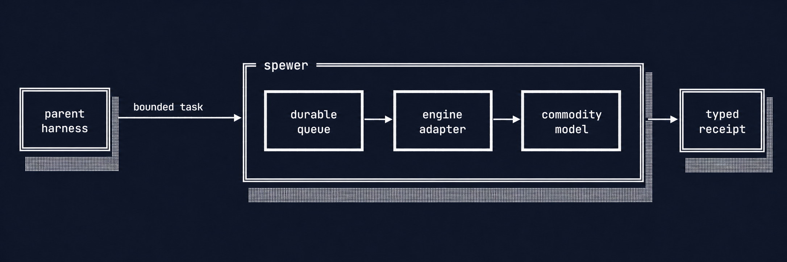
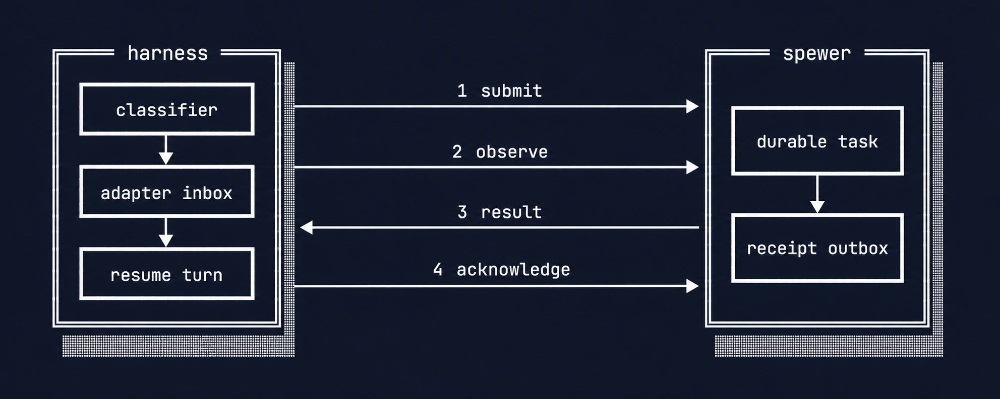

# Spewer

Spewer is a local Rust service that lets your current AI harness delegate bounded work to
lower-cost models.

Keep working in Codex, Claude Code, Kimi, or another preferred harness. Spewer runs the delegated
worker, keeps its task alive, and returns an evidence-rich receipt.



The shortest useful path is three commands:

```console
$ cargo install --path . --locked
$ spewer install
$ spewer ask "What is 17 multiplied by 19?" --text
323
```

That is a working Spewer. The next steps add background work, local Qwen3, frontier delegation,
specialized skills, and concurrent workers.

## Start with one useful worker

You need macOS or Linux, Rust 1.96 or newer, and Git. Spewer installs Codex CLI when it is missing.

Version 0.1 uses hosted `gpt-5.6-luna` through Codex App Server. It does not download model weights
to your machine.

### 1. Install Spewer

Install the current checkout:

```console
$ cargo install --path . --locked
```

Prepare Luna, the generic worker capsule, the Codex delegation skill, and the detached service:

```console
$ spewer install
```

A successful response includes `"ready": true` and a generic `default` capsule.

If Codex needs authentication, run `codex` once. Then repeat `spewer install`.

### 2. Ask one foreground question

Run a question and wait for its answer:

```console
$ spewer ask "What is 17 multiplied by 19?" --text
323
```

This proves that configuration, App Server startup, Luna access, execution, and receipt creation
all work.

Spewer writes progress to standard error. The requested text or structured result stays on
standard output.

### 3. Let a task run in the background

Detach work when you want the caller to continue immediately:

```console
$ spewer ask "Inspect the parser tests and summarize any failures." --detach
```

Spewer returns a durable `task_id`. Check it when convenient:

```console
$ spewer check <task-id>
```

When `ready` becomes `true`, the response contains the stable terminal receipt. Until then, wait
for `observation.poll_after_ms` before checking again.

Cancel work you no longer need:

```console
$ spewer cancel <task-id> --reason "the parent no longer needs it"
```

### 4. Add a local Qwen3 worker when you want one

Ollama can serve the shipped Qwen3 reference model on your machine. Pull it explicitly because
the model download is large:

```console
$ ollama pull qwen3:30b-a3b
$ spewer doctor --engine ollama --model qwen3:30b-a3b
```

Register the installed model as another capsule:

```console
$ spewer capsule add qwen3-local --engine ollama --model qwen3:30b-a3b
```

The running service discovers the capsule without restarting. Ask through it directly:

```console
$ spewer ask "What is 17 multiplied by 19?" --capsule qwen3-local --text
323
```

Its capability card advertises `"network": false` and `"tools": []`. Frontier adapters can
therefore keep live-data and tool-dependent work before they submit it.

Missing Ollama telemetry stays missing in receipts. The text view labels cached and reasoning
counts as `not-reported`; an unpriced local run reports `cost=local-unpriced`.

The CP18 Ollama worker performs read-only inference. It receives the objective, notes, projected
files, acceptance criteria, and any bound skill. It rejects tasks that request commands or file
writes.

The `default` Luna capsule remains available for work that needs the Codex agent tool loop.

### 5. Delegate from Codex without changing harnesses

`spewer install` already installs the reference Codex skill. You do not need a separate
`spewer connect` command.

Ask Codex explicitly for the first proof:

```text
Use Spewer to delegate this bounded task to the default capsule:
inspect the parser tests and return a concise failure summary.
```

The skill uses three Spewer commands:

```console
$ spewer delegate task.json --capsule default
$ spewer check <task-id>
$ spewer cancel <task-id> --reason "the task is no longer needed"
```

Codex keeps the conversation and final judgment. Spewer runs Luna and returns the worker's
receipt.

### 6. Turn a generic worker into a specialist

Bind any valid `SKILL.md` or skill directory to a capsule:

```console
$ spewer capsule bind default /absolute/path/to/review-skill
```

The running service updates immediately. Confirm the new capability card:

```console
$ spewer capabilities
```

The `default` capsule now reports `"kind": "specialized"` with the skill name, revision, and
digest. New delegated tasks receive an immutable copy of those instructions.

Ask Codex to use it:

```text
Use Spewer's default capsule to review these parser changes.
Apply the bound review skill, then judge the returned receipt.
```

Return the same worker to generic service at any time:

```console
$ spewer capsule unbind default
```

## Run more workers when you need them

One service can lease several local App Server workers concurrently. Restart it with four worker
slots:

```console
$ spewer stop
$ spewer install --max-workers 4
```

`spewer stop` stops new acceptance and drains accepted work first. The next installation starts
the service with the new limit.

Version 0.1 scales across local worker processes. Distributed workers on several machines are not
implemented yet.

## Spewer keeps delegated work accountable

The frontier harness owns classification, its private continuation, and the final answer. Spewer
owns accepted work until it can return a terminal receipt.



Four mechanisms make that handoff useful:

- the durable queue keeps accepted tasks after the initiating turn exits;
- permissions and budgets bound worker authority;
- the event journal reconstructs state after a restart;
- receipts identify the capsule, skill, model, usage, artifacts, and verification.

Spewer requeues pristine interrupted work. It escalates work with uncertain external effects
instead of risking duplicate execution.

Cost stays unknown unless `SPEWER_PRICE_CONFIG` points to a matching versioned price file. Spewer
never converts missing price data into zero.

## Know what works today

| Capability | Status |
|---|---|
| Generic Luna worker through Codex App Server | Implemented |
| Foreground questions and detached tasks | Implemented |
| Live generic or specialized capsules | Implemented |
| Immutable skill binding and receipt evidence | Implemented |
| Configurable local worker concurrency | Implemented |
| Reference Codex delegation skill | Implemented |
| Complete durable Play adapter | Implemented |
| Local Qwen3 inference through Ollama | Implemented in CP18 |
| Local-model command execution and file writes | Not implemented |
| Native integrations for other frontier harnesses | Planned |
| Distributed multi-machine workers | Not implemented |

Inferred `spewer ask` tasks use read-only filesystem authority and deny network access by default.
The service routes both Codex App Server and local Ollama capsules.

## Go deeper only when you need to

- [How Spewer works](docs/how_it_works.md) explains the product, every component, and both complete
  user flows.
- [Task protocol](docs/03-task-protocol.md) defines requests, events, receipts, and delivery.
- [Durability](docs/05-durability.md) and [crash closure](docs/13-crash-closure.md) explain restart
  behavior.
- [Security](docs/07-security.md) defines permissions, approvals, and side-effect boundaries.
- [Frontier integration](docs/17-frontier-integration.md) defines the small harness client.
- [Play integration](docs/10-play-integration.md) defines the first complete durable parent
  adapter.
- [Design index](docs/readme.md) links every accepted contract and decision.
- [Checkpoint evidence](artifacts/checkpoints) records the proof through CP18.

## Build and verify Spewer

Spewer forbids unsafe code, panic primitives, unchecked indexing, and unchecked arithmetic.
Handwritten Rust files stay at or below 500 physical lines.

Run the complete local gate before committing:

```console
$ cargo fmt --all -- --check
$ cargo clippy --all-targets --all-features -- -D warnings
$ cargo test --all-targets
$ RUSTDOCFLAGS="-D warnings" cargo doc --locked --no-deps
$ cargo deny check
$ cargo machete
$ ./scripts/check-rust-source-lines.sh
$ ./scripts/check-doc-lines.sh
$ ./scripts/check-panic-primitives.sh
$ ./scripts/check-codex-schema.sh
```

## License

Apache-2.0. See [LICENSE](LICENSE).
