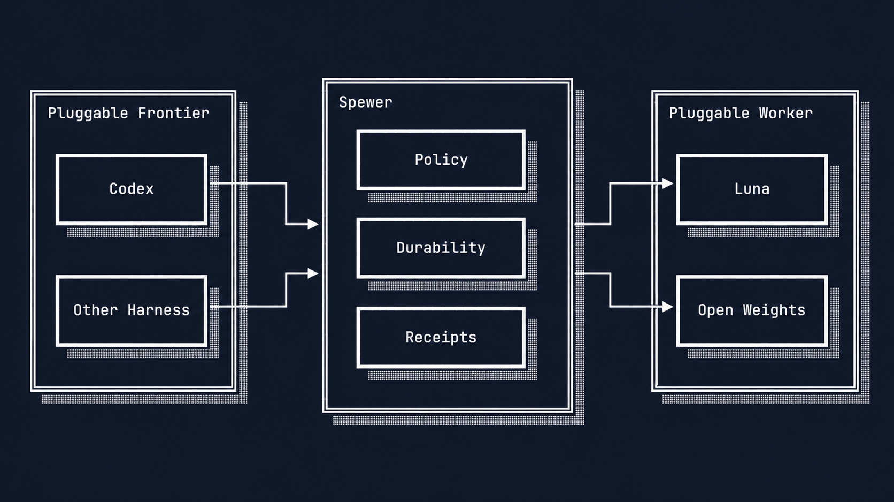
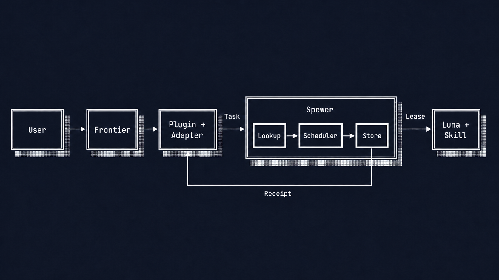
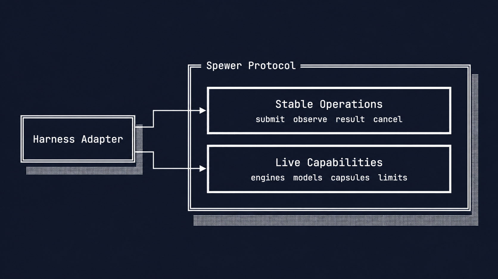
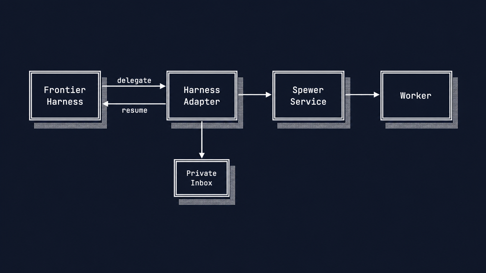
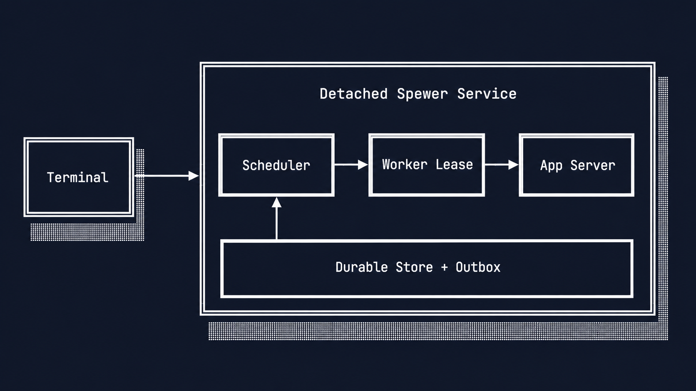
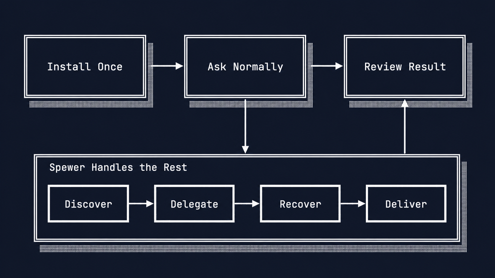
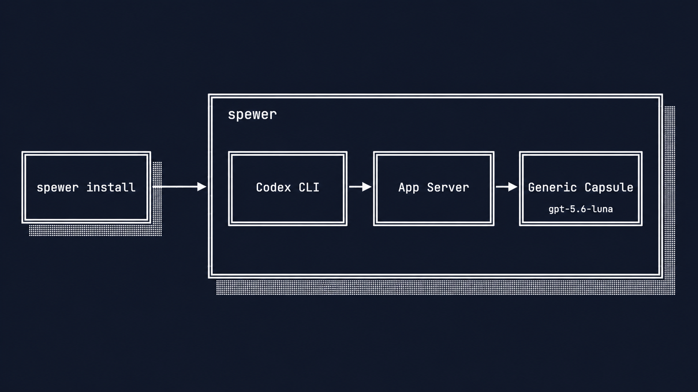
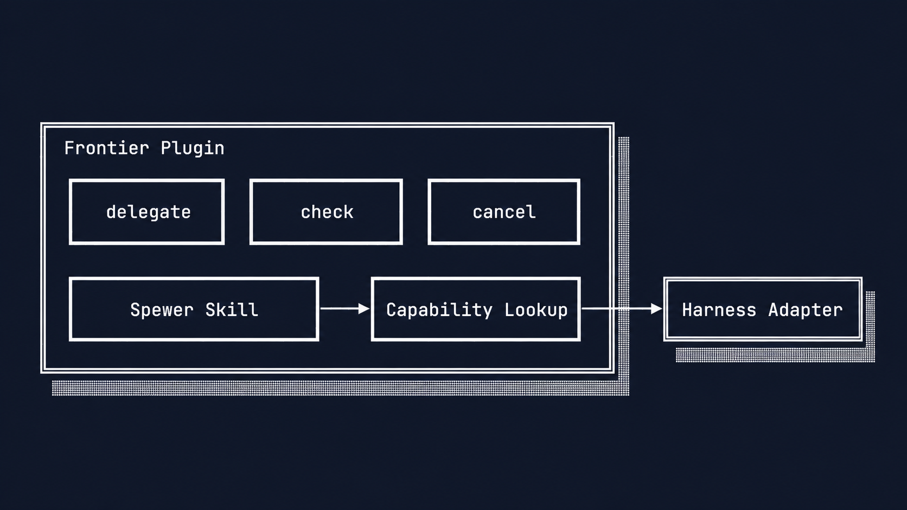

# Spewer lets your frontier harness delegate repeatable work

Status: **Implemented through CP17**

Date: **2026-08-29**

Spewer is a local delegation service for frontier harnesses. You keep working in Codex,
Claude Code, Kimi, or another preferred harness. A lower-cost worker handles bounded work.

The frontier harness keeps the conversation, broad context, judgment, and final answer.
Spewer owns the delegated task, worker capacity, restart recovery, and terminal receipt.

This document has three parts:

1. Why Spewer exists and which parts make it work.
2. How to install and use the generic Luna worker.
3. How to specialize that worker without changing the frontier harness.

## Part I: Spewer adds delegation without replacing your harness

OpenCode and Pi are coding harnesses. Both can connect their own agent experience to many
providers and models.

Spewer solves a different problem. It connects the harness you already chose to durable
commodity workers behind one local protocol.

You do not move your primary work into Spewer. You keep using the harness whose interface,
context handling, tools, and subscriptions already work for you.

Spewer installs a worker runtime behind the service. It does not ask you to adopt another
primary agent interface.

### Provider choice and durable delegation solve different problems

A provider abstraction chooses the model for the current harness turn. Spewer sends bounded work
out of that turn, keeps it alive independently, and returns evidence.

| Concern | OpenCode or Pi | Spewer |
|---|---|---|
| Primary role | Interactive coding harness with model choice | Local delegation service |
| Where the user works | Inside that harness | Inside the user's existing harness |
| Worker selection | Selects a provider and model for its agent | Selects a generic or specialized capsule |
| Delegated lifetime | Owned by the harness | Owned by a durable task journal |
| Returned result | Agent response in that harness | Typed receipt with execution evidence |
| Replacement cost | Adopt another harness experience | Add Spewer to the harness already in use |

This distinction makes Spewer complementary to Codex, Claude Code, Kimi, OpenCode, and Pi.
Any of them can remain the frontier harness when it has a suitable Spewer adapter.

### Spewer moderates repeatable work instead of replacing frontier judgment

Delegation fits work with a clear objective, bounded authority, and a checkable result. The
frontier keeps novel reasoning, ambiguous tradeoffs, user interaction, and final accountability.

Every receipt records the selected capsule, skill, model, usage, artifacts, and verification.
These facts let the frontier accept, reject, refine, or retry the worker result.

Future routing policy can use repeated evidence to prefer lower-cost workers. Spewer does not
silently change authority or claim that one successful task proves a permanent route.

The logical boundary stays the same when either endpoint changes.



### Eight parts keep the boundary understandable

The complete flow contains eight parts. Each part owns one kind of state.

| Part | What it owns | Why it exists |
|---|---|---|
| Frontier harness | User conversation and final judgment | The user stays in their preferred agent experience. |
| Spewer integration skill | When delegation fits | The frontier model learns the delegation boundary. |
| Harness adapter | Host continuation and protocol calls | Harness-private state never enters Spewer. |
| Protocol and capability cards | Stable operations and live workers | Adapters discover current generic or specialized capsules. |
| Spewer service | Acceptance, queueing, capacity, and cancellation | Accepted work survives the frontier turn. |
| Task journal and outbox | Events, recovery state, and receipts | Restarts do not erase accepted work or terminal results. |
| Capsule and engine driver | Worker configuration and model connection | Spewer can change workers without changing its public lifecycle. |
| Receipt | Outcome, model identity, skill identity, and evidence | The frontier can judge before using the result. |

The connected visual shows where each responsibility sits.



### The capsule describes the worker available now

A capsule is an advertised worker configuration. It names the engine, model, purpose, and
current specialization.

The installed `default` capsule begins as `generic`. It uses Codex App Server with
`gpt-5.6-luna` and accepts ordinary bounded work.

Binding a `SKILL.md` changes the same capsule to `specialized`. The worker remains behind the
same Spewer service and protocol.

Spewer currently ships hosted Luna through Codex App Server. Luna is the default commodity
worker, not an open-weights model downloaded to the machine.

An open-weights engine will use the same capsule boundary. That second production engine is
CP18 work and is not implemented today.

### Capability cards describe live state

The protocol has a stable operation set and a live capability catalog. The stable operations
change only with protocol compatibility; the catalog changes when a worker or skill changes.



Each capsule card contains:

- a stable capsule ID;
- a content revision;
- `generic` or `specialized` state;
- the engine kind and model;
- a short purpose description;
- safe skill identity and digest when specialized.

The card never exposes local skill paths or instruction text. Spewer reads the exact skill only
after an adapter selects that capsule revision.

### The adapter preserves the frontier harness

The adapter translates one harness lifecycle into Spewer operations. It also retains the
harness's private continuation.



The reusable client provides four host operations:

- `discover` reads service capabilities and live capsule cards;
- `delegate` binds one current card and accepts a durable task;
- `check` returns progress, a polling delay, and any terminal receipt;
- `cancel` stops unwanted work idempotently.

The model-facing skill keeps this surface to three actions: delegate, check, and cancel.
Discovery occurs inside the adapter or during delegation.

### The detached service makes delegation restart-safe

Spewer accepts a task before it starts a worker. The scheduler then leases queued work up to
the configured worker limit.



The service records every transition in SQLite. It rebuilds task projections from that journal
after a restart.

Pristine interrupted work can return to the queue. Work with uncertain external effects becomes
`escalated` instead of running twice.

This is conservative restart safety, not a claim that every failure disappears. Spewer preserves
accepted work and refuses to guess when replay could duplicate an effect.

## Part II: Install and use the generic Luna worker

The shortest useful path installs Spewer, verifies Luna, and makes delegation available to
Codex. It does not require a separate connection ceremony.

The user experience stays at install, ask, and review.



The installation visual shows what one command prepares.



### Step 1: Install Spewer and its shipped worker

Install the current checkout:

```console
$ cargo install --path . --locked
```

Prepare the worker and service:

```console
$ spewer install
```

The command performs these actions:

1. Finds Codex CLI or runs its official installer.
2. Creates owner-private Spewer configuration.
3. Creates the generic `default` Luna capsule.
4. Verifies the Codex App Server handshake and authentication.
5. Installs the reference Codex delegation skill.
6. Starts or reuses the detached Spewer service.

If authentication is missing, run `codex` once and repeat `spewer install`. Spewer reports
readiness only after the App Server handshake succeeds.

### Step 2: Prove the worker responds correctly

Run one foreground question:

```console
$ spewer ask "Return only the sum of 17 and 19." --text
36
```

This command waits for Luna and prints its answer. A correct answer proves configuration,
App Server startup, model access, execution, and receipt creation.

Inspect the worker card:

```console
$ spewer capabilities
```

The response should advertise `default` as `generic`, with engine `codex-app-server` and model
`gpt-5.6-luna`.

The relevant card looks like this:

```json
{
  "id": "default",
  "revision": "<capsule-sha256>",
  "kind": "generic",
  "description": "General bounded work through Codex App Server",
  "engine": {
    "kind": "codex-app-server",
    "model": "gpt-5.6-luna"
  },
  "skill": null
}
```

### Step 3: Choose foreground or background work

Use foreground mode when the caller should wait for the answer:

```console
$ spewer ask "Summarize the repository test strategy." --text
```

Use detached mode when the caller should continue other work:

```console
$ spewer ask "Inspect the parser tests and summarize failures." --detach
```

Detached mode returns a durable task ID. Check it without blocking the frontier harness:

```console
$ spewer check <task-id>
```

If `ready` is false, wait for `observation.poll_after_ms` before checking again. A complete
request submitted with `spewer delegate` always uses this durable background path.

### Step 4: Let the frontier harness use Spewer

`spewer install` already places the reference skill at this location:

```text
${CODEX_HOME:-$HOME/.codex}/skills/spewer-delegation/SKILL.md
```

There is no required `spewer connect <harness>` command. The installed skill teaches Codex
when bounded delegation is appropriate.

The integration visual shows the three commands exposed to the frontier model.



The current Codex skill uses:

```console
$ spewer delegate task.json --capsule default
$ spewer check <task-id>
$ spewer cancel <task-id> --reason "the parent no longer needs it"
```

For the first end-to-end proof, ask Codex explicitly:

```text
Use Spewer to delegate this bounded task to the default capsule:
inspect the parser tests and return a concise failure summary.
```

Codex keeps the user conversation. Spewer runs Luna and returns the receipt. Codex then judges
that receipt before answering the user.

The current integration is an Agent Skill over the CLI client. Native packages for Claude Code,
Kimi, OpenCode, Pi, and other harnesses remain future integration work.

### Step 5: Increase local worker capacity

Spewer can lease several local workers concurrently. Start a new service with four worker slots:

```console
$ spewer stop
$ spewer install --max-workers 4
```

`spewer stop` first stops acceptance and drains accepted work. The next installation starts the
service with the new limit.

Each active lease starts its own App Server worker in version 0.1. The journal, scheduler, and
outbox coordinate those workers through one service.

This is local concurrent scale-out. Distributed workers on several machines are not implemented.

## Part III: Specialize the same worker with a skill

Specialization changes what the worker advertises. It does not replace Spewer, the service,
the protocol, or the frontier harness.

### Step 1: Bind a skill to the default capsule

Bind a valid skill directory or `SKILL.md`:

```console
$ spewer capsule bind default /absolute/path/to/review-skill
```

The manifest records the skill name, description, revision, digest, and private local source.
The running service does not restart.

Confirm the change:

```console
$ spewer capabilities
```

The `default` card now reports `kind: specialized` and includes safe skill metadata. The catalog
revision and capsule revision change immediately.

The specialized card adds the bound skill identity:

```json
{
  "id": "default",
  "revision": "<new-capsule-sha256>",
  "kind": "specialized",
  "engine": {
    "kind": "codex-app-server",
    "model": "gpt-5.6-luna"
  },
  "skill": {
    "name": "review",
    "description": "Review bounded code changes",
    "revision": "1",
    "digest": "<skill-sha256>"
  }
}
```

### Step 2: Let the adapter recognize specialization

An adapter calls `discover` or `spewer capabilities` to read current cards. It can cache the
catalog until the catalog revision changes.

For the reference Codex skill, `spewer delegate --capsule default` performs that lookup again.
The response returns the selected card, including its specialized state and skill identity.

Spewer independently validates the card before accepting work. A stale revision, edited skill,
missing source, or engine mismatch fails before the task enters the queue.

The accepted task stores an immutable copy of the exact skill instructions. Later edits, binds,
or unbinds affect new tasks only.

### Step 3: Ask the specialized question through the frontier harness

Ask Codex to use the specialized default worker:

```text
Use Spewer's default capsule to review these parser changes.
Apply the bound review skill and return the receipt with your final judgment.
```

The sequence is now:

1. Codex classifies the task as bounded and independently checkable.
2. The adapter reads the live `default` card.
3. Spewer snapshots its specialized skill before acceptance.
4. Luna performs the task with those exact instructions.
5. Spewer stores events and emits one terminal receipt.
6. Codex checks the receipt and gives the user its own final answer.

The receipt identifies the capsule revision, specialization, skill digest, requested model, and
observed model. It never includes the private skill instructions.

Unbind the skill to return the same worker to generic service:

```console
$ spewer capsule unbind default
```

### Current boundaries remain explicit

| Capability | Current status |
|---|---|
| Generic Luna capsule through Codex App Server | **Implemented** |
| Foreground questions and detached tasks | **Implemented** |
| Durable journal, recovery, cancellation, and receipts | **Implemented** |
| Configurable local worker concurrency | **Implemented** |
| Live generic or specialized capability cards | **Implemented** |
| Immutable skill binding and receipt evidence | **Implemented** |
| Reference Codex delegation skill | **Implemented** |
| Durable host continuation and receipt application | **Implemented for Play** |
| Semantic ranking across several capsules | **Planned** |
| Production open-weights engine | **Planned for CP18** |
| Native integrations for other frontier harnesses | **Planned** |
| Distributed multi-machine workers | **Not implemented** |

## The product promise stays small

Keep the frontier harness you already trust. Give it one durable way to delegate bounded work
to a lower-cost generic or specialized worker.

## Sources

- [OpenCode](https://github.com/anomalyco/opencode) describes itself as an open-source coding
  agent; its [provider documentation](https://opencode.ai/docs/providers) covers model and
  provider selection.
- [Pi](https://github.com/badlogic/pi-mono) includes a multi-provider model API and an interactive
  coding-agent harness.
- [Codex CLI](https://learn.chatgpt.com/docs/codex/cli) describes the supported standalone CLI
  installation and sign-in flow.
- [Codex App Server](https://learn.chatgpt.com/docs/app-server) describes `codex app-server`, its
  stdio transport, and initialization handshake.
- [Codex skills](https://learn.chatgpt.com/docs/build-skills) describes skill metadata and loading.
- [Spewer architecture](02-architecture.md), [task protocol](03-task-protocol.md),
  [capsule execution](16-capsule-bound-execution.md), and
  [frontier integration](17-frontier-integration.md) define the accepted local contracts.
